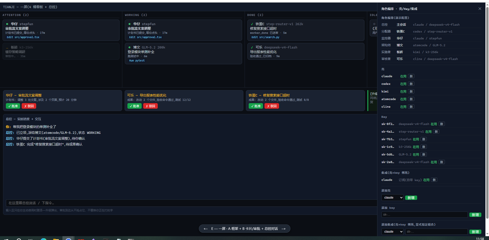

# 天机 (Tianji)

> 手里有什么牌，都能打。

天机是一个多模型、多编排流程（助手）级别的脚手架。你手里的 AI 助手和 key，成色不一、来路各异——它按表现把它们编成一支队伍：贵的用在刀刃上，便宜的拿去干杂活，从接单、派活、验收到返工，整条流水线自动跑。你只跟"总控"一个人说话，剩下的不用你操心。

**而且这套系统是它自己管自己写出来的。** 天机先手写了一个最小版本，跑通之后，剩下的功能就全交给它自己：自己拆任务、自己派活、自己验收、自己归档。下面说的每一项功能都是这么来的。所以它身上没有纸面设计——所有机制都是被真实使用逼出来的，不好用的早就改掉了。

[](LICENSE)
[](https://www.python.org/downloads/)
[](https://github.com/SiwenPz/Tianji/releases)
[](https://github.com/SiwenPz/Tianji/discussions)

<p align="center">
  
</p>
<p align="center"><sub>驾驶舱原型：左边任务看板，右边角色编排，底下总控对话流（界面翻新中）</sub></p>

## 为什么做这个

模型的档位拉得越来越大：好用的模型厂商定价越来越贵，5 小时限额、日限额、周限额、月限额层出不穷，很难什么活都交给它；小一点的模型厂商活动越来越多、各种搞体验、送额度，能力却总差一口气。转了一圈下来，许多人手里渐渐攒了一批用不顺手、又舍不得扔的算力：

- 小一些模型厂商的官 key：稳定、便宜，但是能力有限；
- 各家助手内置的免费模型和额度：锁在人家壳里，API 调不着，额度受限、免费期还说不准；
- 各处攒下的第三方 key：一个 key 对应一堆来路不明的模型，今天能用，明天抽风。

传统多 Agent 编排要么假设你有个整齐的模型池，谁都能干、干得一样好；要么就是同一个模型同一套编排框架分出多个 Agent 玩 cosplay，看着热闹，却很容易陷入自查自审的坑。

天机是多模型 + 多编排流程（助手）级别的脚手架：编排粒度落在助手上，尽可能发挥锁在助手里的内嵌模型与小模型的能力。

我始终相信：没有差模型，只有没放对位置的模型——高级的把关，低级的干活，账本记着谁靠谱，一样可以把活儿干得漂亮。

## 天机怎么管

**派活看成绩单。** 每个"壳+key+模型"的组合都有表现分，干一单记一单：按时完工加分，被验收打回扣分，进程死了活没干完扣分。派活时先看够不够格（上下文装不下、权限不够的靠边站），再按分数排队。干得好的越派越多，干得差的往后排——但不拉黑，万一人家只是那天网络不好呢。这些数据全是平时干活攒下来的，天机不会专门烧你的额度去测速。

**什么配置什么成色，当面说清楚。** 多助手最怕的是看着双保险，实际自己审自己。天机给每个组合标成色：不同 key 不同壳，互相挑刺最狠；同一张 key 同一个壳，就是自己查自己。哪怕你只买得起一张 key，流程也照跑，只是安装的时候就告诉你：这套是自查自审，别指望交叉验证。

**完工要交差，嘴上说了不算。** 工人干完活必须交一份"结算单"，带身份凭证，账本认了才算完。光在窗口里说"我做完了"？没用，监控回头对账，发现你声称完了却没交单，会捅到你面前。冒名交单、重复交单，账本直接拒收。

**卡住有人管，但不动手杀。** 监控盯的是实打实的信号：文件还在不在长、进程还活着没、事件还来得来。真卡住了会提醒你，但不会替你把它杀了——宁可多报一次警，也不错杀一个正在干活的。它还分得清状况：发了求助在等答复的，不算卡死；在等后台任务跑完的，不算卡死；你自己家断网了，全体暂停计时，不轰炸你。

**验收过三关。** 第一关机器跑验收命令、查改动范围，跑出说好的边界直接打回；第二关两个不同的助手、不同的模型，一个查"照没照着要求做"，一个查"活干得细不细"；第三关架构师拍板，最后你点头才归档。打回了就自动重派，新任务书里会写清楚上次差在哪，不让工人瞎猜。同一个活最多返工三次，超了就停下来通知你——不无限烧你的钱。

**工人干不动可以喊救命。** 有专门的求助通道，说清楚卡在哪、试过什么，总控给思路或者换人。求助不算失败，不占返工次数。被误判成"卡住"的，一条命令复活，接着干。

**花钱的事，你说了算。** 机器自动做的都是不花钱、能反悔的事：额度用完了就暂停派新活并告诉你。换人、换 key、调模型的思考档位这些要花钱的决定，全留给你。

## 快速开始

需要 Python 3.9+：

```bash
pip install git+https://github.com/SiwenPz/Tianji.git
# 或下载 Releases 的 zip，解压后 pip install .

# 就这一条命令：建账、起服务、自动打开浏览器进配置页
tianji start
```

配置全程在网页里点选，不用敲命令：

1. **选总控**：下拉框列出你机器上装了、又能当总控的助手（目前 Claude Code 和 kimi 两家）；
2. **配工人**：每个助手选模型来源——自带的免 key，或者填 key 和地址、点"探测"自动列出能用的模型，再定它当工人还是当审核、开几个；
3. 编制清单一行一个，审核没配齐会当场标红提醒你；
4. 点"配齐了，去开工"，进驾驶舱，直接跟总控说话。

以后干活都在驾驶舱（`http://127.0.0.1:8787`），习惯终端的也可以用 `tianji console`。换模型、换 key 不用重配，一条命令的事。

## 支持哪些助手

理论上，所有命令行 AI 助手都能接：能在终端里跑、能被脚本唤起，就有办法进编制。每个人的牌面不一样——有人官 key 党，有人订阅党，有人专门收集活动额度——天机不管你什么出身，只关心一件事：这玩意儿在你机器上能不能干活。目前实测跑通过五家（Claude Code、codex、kimi、atomcode、cline），从主力档到免费档都有。

信号采集三层兜底：原生钩子为主，状态文件做校验，进程信号保底——哪层缺了就如实记录、换别的法子判断，不会瞎猜。想接新壳，照"八问检查单"过一遍就能进编制。

## 它是怎么分工的

```
        你
        │ 只跟这一个人说话
        ▼
      总控 ────── 建任务、批计划、最后点头
        │
        ▼
     分配器 ──── 派活（带任务书），脚本，不用模型
        │
        ▼
      工人们 ──── 干活（可以好几个，按成绩选派谁）
        │ 交结算单
        ▼
      审核者 ──── 两个不同的助手交叉验收
        │
     监控器 ──── 全程盯梢：还活着没、卡住没，脚本，不用模型
        │
        ▼
   一切进出都记账（一个 SQLite 文件，出了事翻账还原现场）
```

架构师负责拆活写计划，你点头才动手。工人和审核永远不会跑来直接问你问题——能自己查的自己查，必须问的由总控攒一批、附上建议答案，一次性问你。

## 现在到哪一步了

v0.7.0，原型期，但整条流水线是真的每天在跑：

- `tianji start` 一键起步，配置全在网页里点选：选供应商、填 key、点"探测"自动列出能用的模型，挑一个就成
- 驾驶舱网页：全局快照、审批、报警一目了然，跟总控聊天有流式回复、能看到它在想什么（总控目前支持 Claude Code 和 kimi，按协议接的，新助手说同一种协议就能直接用）
- 编制是数据不是代码：协议、供应商、key 各自登记成条目，新助手按协议填条数据就能进编制，一行新 Python 都不用写
- 纪律写死在机器里：干活的不许审自己的活，审核和架构师必须是不同的组合，不靠提示词自觉
- 交单要验明正身：结算单身份对不上，账本直接拒收，谁也冒名不了谁
- 成绩派活、组合红黑榜、双轴验收、返工上限
- git 项目自动开独立分支干活，多人并行互不打架，你确认后合并回主分支
- 工人求助、卡住续推、强制改派、账本每日自动备份

还在做的：更多壳的网页版总控会话（ACP 协议的填条数据就能接）、消息推送（现在是 1.5 秒刷一次）。

也得说实话，离"什么牌都能打"的理想还有距离：总控本身吃 token 不少，靠缓存命中找补的路子还在琢磨；低档模型和那些时好时坏的 key 闹出的频繁返工，也还没治理利索——打算给常出问题的组合开个账号池轮盘，老出错的就下场歇会儿。骨架立住了，肉还在长。

## 常见问题

**只有一张 key 能玩吗？**
能，全流程照跑，就是自己干自己审，质量打折。安装时会明说，不糊弄你。

**我的 key 安全吗？**
key 本体留在各助手自己的配置目录里，天机的账本只存个引用，不碰机密。

**烧钱吗？**
设计上处处省：不派测速活、不整段读历史记录、返工有上限、花钱的决定全留给你。

**支持 Windows 吗？**
当前就在 Windows 10 上开发的，设计时按跨平台写的，macOS/Linux 欢迎实测反馈。

**跟其他多 Agent 框架什么区别？**
传统的路数要么假设你有个整齐的模型池，谁都能干、干得一样好；要么同一个模型分出多个 Agent 玩 cosplay，看着热闹，容易自查自审。天机是多模型 + 多编排流程（助手）级别的脚手架：编排粒度落在助手上，高级的把关，低级的干活，成色标注防着自查自审，账本记着谁靠谱。

## 参与贡献

原型期，欢迎 Issue 和 PR。想接新壳的，issue 里喊一声，检查单会告诉你该查哪几项。

用的时候卡住了去 [Discussions 的 Q&A](https://github.com/SiwenPz/Tianji/discussions) 提问，觉得哪里设计不对就去 Ideas 拍砖——有问必答。

## License

[MIT](LICENSE)
